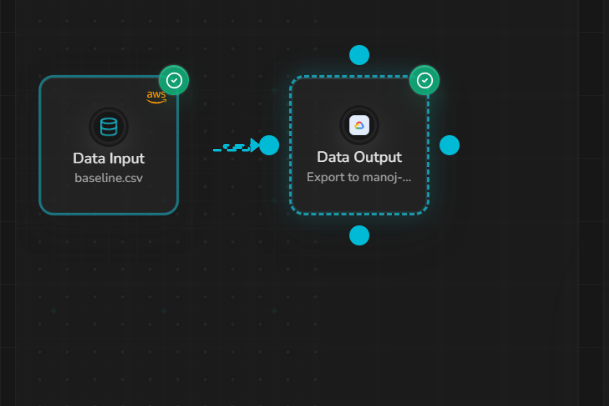
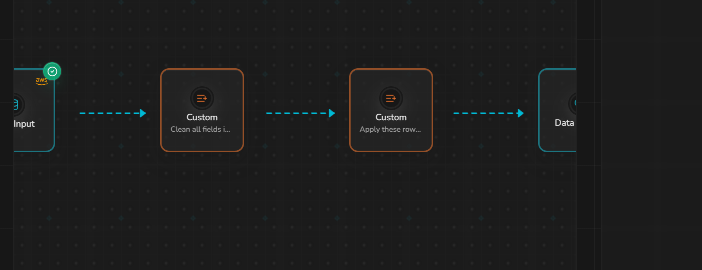
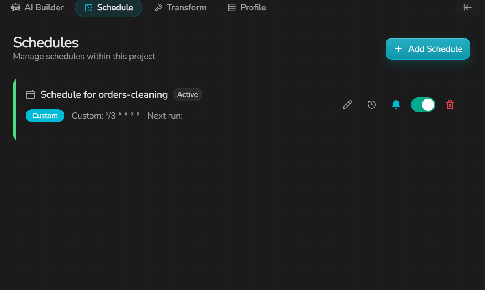
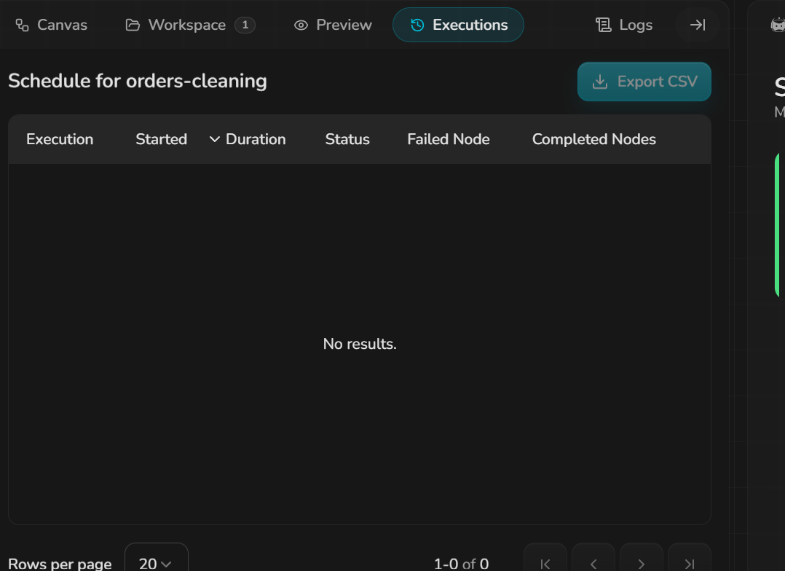
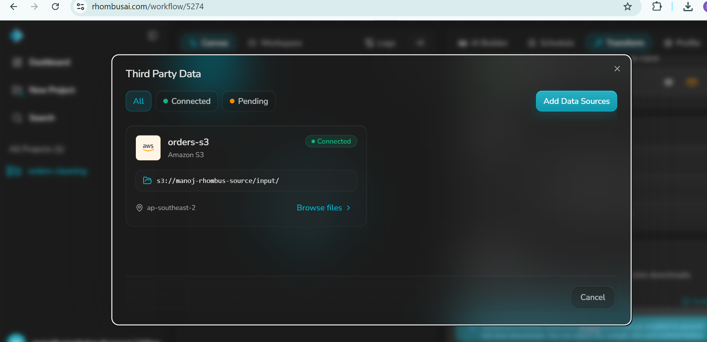
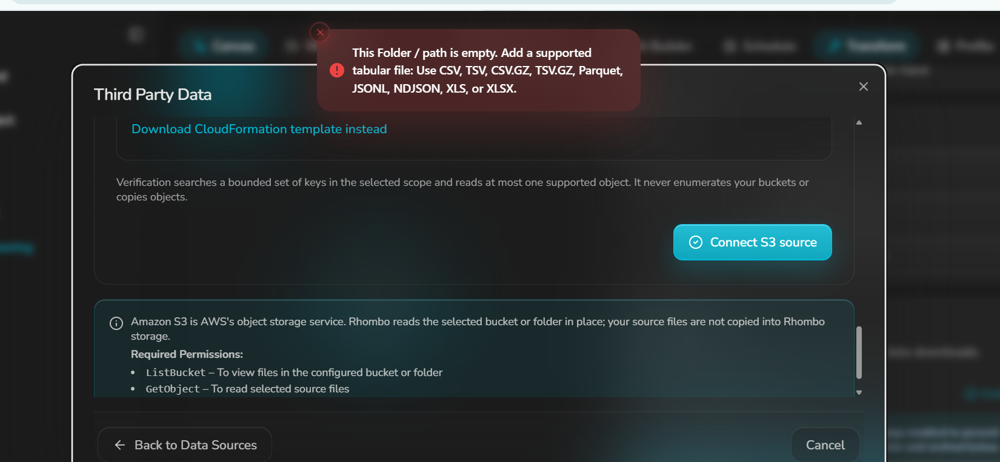
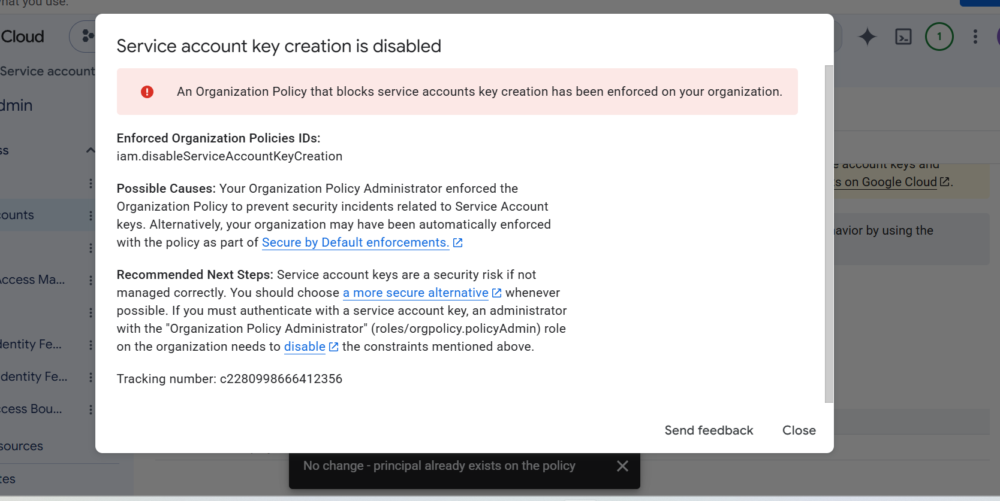
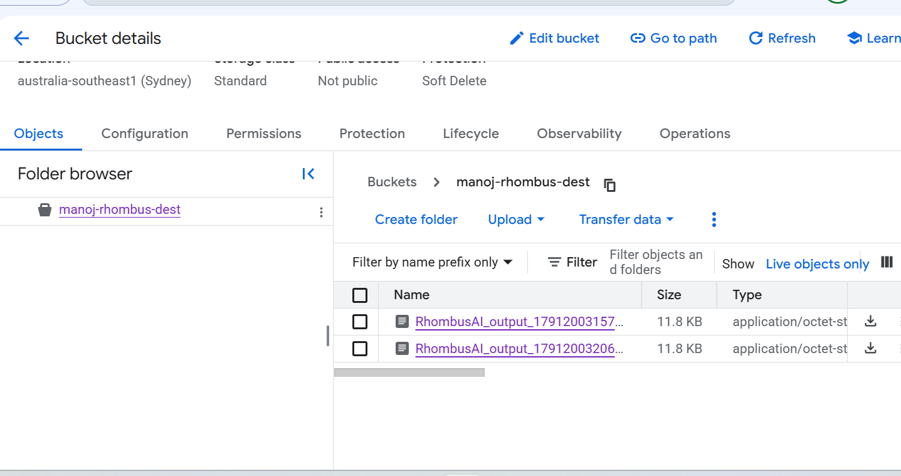
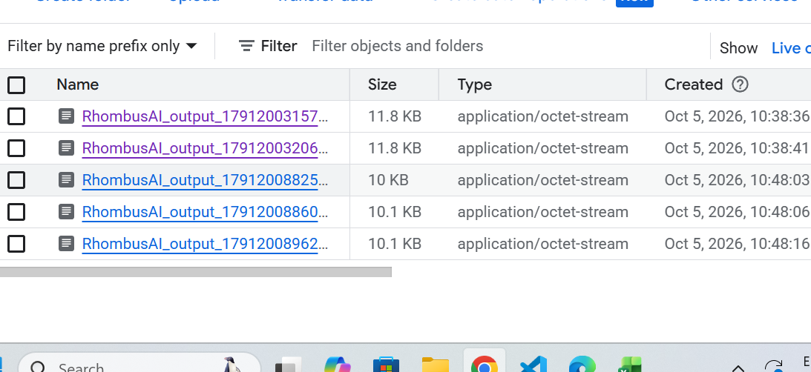
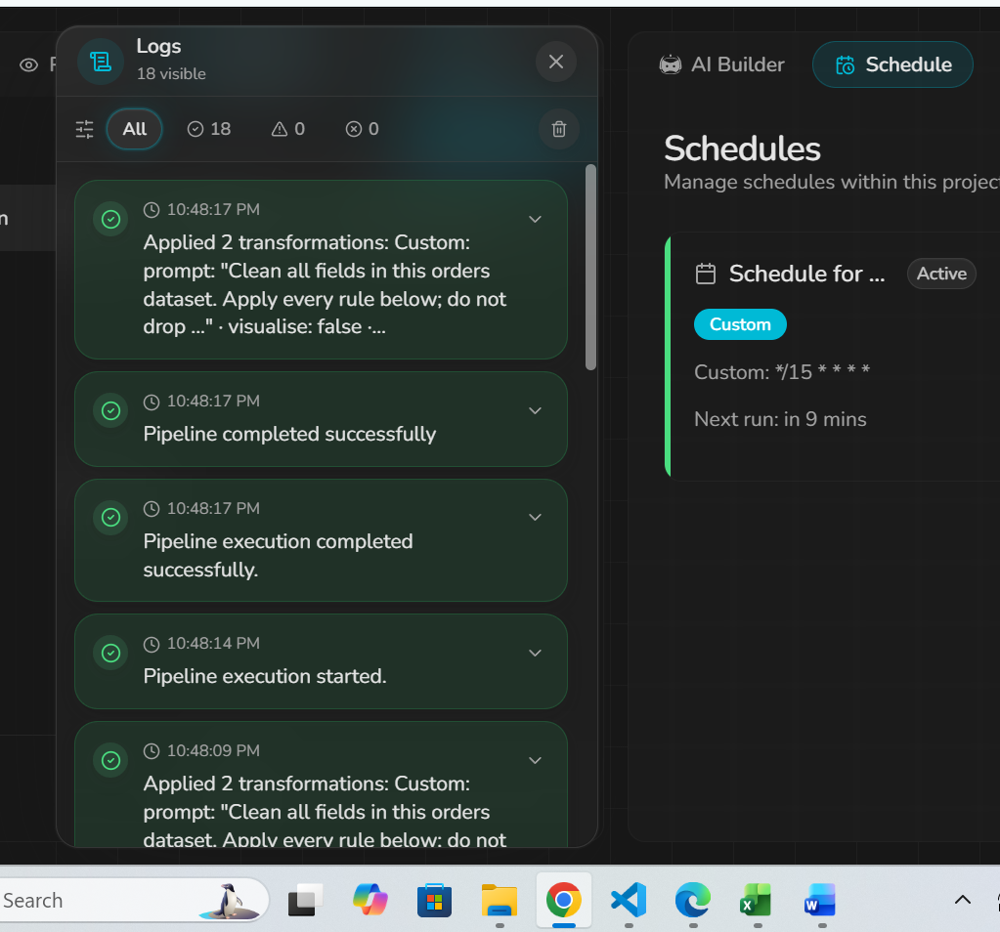

# Baseline build: AI builder silently drops 60% of rows at the date step

| | |
|---|---|
| **Dataset** | [`datasets/baseline.csv`](../datasets/baseline.csv) (132 rows) |
| **Prompt** | [`datasets/ai_builder_prompt.txt`](../datasets/ai_builder_prompt.txt) (sent in one message) |
| **Workflow** | `orders-cleaning` (rhombusai.com/workflow/5274) |
| **Severity** | **High**: valid data discarded with an incorrect explanation; chat result ≠ pipeline result; non-deterministic output |

## What I did
Connected S3 (`s3://manoj-rhombus-source/input/baseline.csv`), attached the Data Input node to the AI Builder, and sent the 8-rule cleaning prompt.

## What I expected
Only rows with genuinely invalid values would be dropped. My reference implementation of the same rules ([`data-validation/validate.py`](../data-validation/validate.py) `reference_clean`) keeps **110 rows**:
- 13 rows removed for empty or duplicate `order_id`
- 2 rows with an invalid date (`2024-13-45`, `not a date`)
- 5 rows with an invalid price or quantity

## What happened
The AI builder produced **44 rows**. Its own summary, quoted:

| Step | Action | Rows in | Rows out | Dropped |
|---|---|---|---|---|
| 2 | Remove empty order_id; deduplicate by order_id | 132 | 119 | 13 |
| 4 | Drop rows with invalid/unparseable order_date | 119 | **49** | **70** |
| 5 | Drop rows where price is non-numeric or negative | 49 | 47 | 2 |
| 6 | Drop rows where quantity is missing or outside 1–1000 | 47 | 44 | 3 |

> "The date step was the largest source of attrition (70 rows), indicating that a large portion of the raw data carried unparseable date values."

## Root cause (verified locally)
`order_date` in the source has three formats: 44 × `YYYY-MM-DD`, 55 × `MM/DD/YYYY`, 31 × `Mon DD YYYY`, plus 2 genuinely invalid values. After de-duplication, exactly **49** rows use `MM/DD/YYYY`, which matches the AI's 49 survivors. The generated step parsed **only** the `MM/DD/YYYY` pattern, so **68 valid ISO and text dates were treated as invalid**.

The prompt said *"Input dates are month-first (MM/DD/YYYY)"*, meaning that ambiguous dates are month-first. The AI read it as *"every date is in exactly this format"*. That reading is defensible, but:
1. **There was no warning before discarding 70 of 119 rows (59%) at a single step**, and no confirmation step.
2. **The explanation is factually wrong.** It says the values were "unparseable" when they were valid dates in standard formats, so a user who trusts the summary would accept the data loss.

## Impact
In a scheduled ETL job this would quietly publish 40% of the data to GCS on every run. A downstream consumer would see a valid-looking file.

## Finding 2: the chat said "All clean", but the pipeline was not cleaned
The first answer cleaned the data **inside the chat** (it produced `baseline_cleaned.csv` there) but added **no nodes** to the workflow. The canvas stayed `Data Input -> Data Output`, so the first two runs wrote the **raw 132-row file** to GCS (`RhombusAI_output_1791200315794.csv`, `...320685.csv`). Validation found duplicates, `$` prices, `india`/`IND`, `PENDING` and `not-an-email`, and 14 of 19 checks failed. Evidence: 

## Follow-up: did the AI fix it?
**Yes.** After the follow-up prompt (below), the AI added 2 `Custom` nodes between input and output. The output `RhombusAI_output_1791200896216.csv` has **110 rows, exactly matching the reference**, and **all cleaning, schema and semantic checks pass** ([report](../data-validation/reports/baseline.md)).

## Finding 3: same input, different output (non-determinism)
Three runs of the unchanged pipeline, 10:48:03 to 10:48:16:

| Run | File | Size | Missing country written as |
|---|---|---|---|
| 1 | `RhombusAI_output_1791200882577.csv` | 10,028 B | **`None`** (10 rows) |
| 2 | `RhombusAI_output_1791200886013.csv` | 10,058 B | `Unknown` |
| 3 | `RhombusAI_output_1791200896216.csv` | 10,058 B | `Unknown` |

All other values are identical (diffed per `order_id`). Run 1 leaked a Python `None` as the literal string `"None"`. Caveat: run 1 may have started while the AI was still finalising the nodes, but nothing in the UI showed this, so a user can't tell which output is correct.

## Finding 4: every run writes a new timestamped file
Outputs are named `RhombusAI_output_<epoch-ms>.csv`. Nothing is overwritten, so downstream consumers must find the "latest" file themselves, and every run (including bad ones) accumulates in the bucket.

## Follow-up prompt that fixed findings 1 and 2
```
Add the cleaning as nodes in this workflow, between the Data Input node and the GCS destination, so scheduled runs apply it. Parse order_date accepting YYYY-MM-DD, MM/DD/YYYY and "Mon DD YYYY"; only drop dates matching none. Expected ~110 rows.
```

## Evidence
- [AI first reply (text)](evidence/baseline-ai-first-reply.txt)
- 

## Finding 5: an "Active" custom-cron schedule never runs
Schedule `Schedule for orders-cleaning`: **Custom `*/3 * * * *`**, badge **Active**, toggle on. The **"Next run:" field is blank**, and the **Executions** tab shows **"No results" (0 of 0)** more than 10 minutes after saving. GCS also received no new objects (last object was the manual run at 11:48:16 UTC). Nothing warns the user that the schedule will not fire.
**Severity: High.** For a scheduled ETL product, a job that looks active but never runs means silent staleness downstream.
Evidence:  

## Setup evidence
- S3 connected: 
- S3 folder field accepted `s3://…/input`, generated a broken bucket policy, and then reported "folder is empty" instead of access denied: 
- GCS service-account key blocked by the default org policy (Rhombus GCS accepts JSON keys only): 
- First outputs were the raw, uncleaned data: 
- Three consecutive runs with differing sizes: 
- `*/15` schedule shows "Next run: in 9 mins" (works, unlike `*/3`): 
- AI's first reply (text): [baseline-ai-first-reply.txt](evidence/baseline-ai-first-reply.txt)
