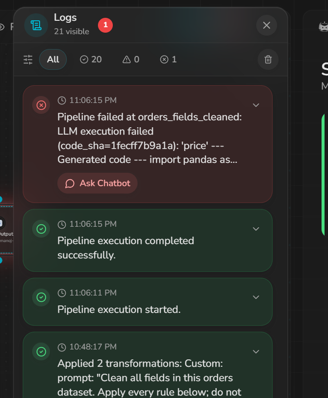

# Schema drift: rename a column

| | |
|---|---|
| **Dataset** | [`datasets/schema_rename_column.csv`](../datasets/schema_rename_column.csv) |
| **Pipeline stopped?** | _FILL: Failed / Warned / Carried on_ |
| **Chatbot fix worked?** | _FILL: Yes / Partly / No / N/A_ |
| **Severity** | _FILL: High / Medium / Low_ |
| **Validation report** | [`data-validation/reports/schema-rename-column.md`](../data-validation/reports/schema-rename-column.md) |

## What I changed
Renamed `price` -> `unit_price`. Values unchanged.

## What I expected
Pipeline should **fail or warn** that `price` is missing. Risk: price-cleaning steps are skipped and uncleaned `unit_price` (with `$`, negatives, `abc`) reaches GCS.

## Steps to reproduce
1. Baseline pipeline `orders-cleaning` is scheduled (S3 `s3://<bucket>/input/orders.csv` -> GCS `gs://<bucket>/output/`), last scheduled run green.
2. Overwrite the S3 source object with `datasets/schema_rename_column.csv` (same key): `aws s3 cp datasets/schema_rename_column.csv s3://<bucket>/input/orders.csv`.
3. Wait for the next scheduled run (do not trigger manually) - _FILL: time of run_.
4. Inspect run status, logs, GCS output; run `python data-validation/validate.py --case schema-rename-column --input datasets/schema_rename_column.csv --output gs://<bucket>/output/<file> --reference datasets/baseline.csv`.
5. Paste the error/log into the AI chatbot, apply its fix, re-run.
6. Restore `datasets/baseline.csv` to S3 before the next case.

## What actually happened
_FILL: run status, duration, what (if anything) landed in GCS. Screenshot:_


## What the logs said
```
FILL: paste log excerpt
```
_FILL: Is the message clear? Does it name the column/file/row?_ 

## What the chatbot said
> FILL: prompt you gave it, and its answer (quote)

_FILL: Was the diagnosis correct?_ 

## Did the fix work?
_FILL: what the fix changed, re-run result, validation verdict after the fix._

## Schedule afterwards
_FILL: still active / paused / disabled? Did the next scheduled run fire?_

## Validation result
_FILL: verdict + failing checks from the report._

## Assessment
_FILL: one or two sentences - impact for a real customer, severity rationale._
